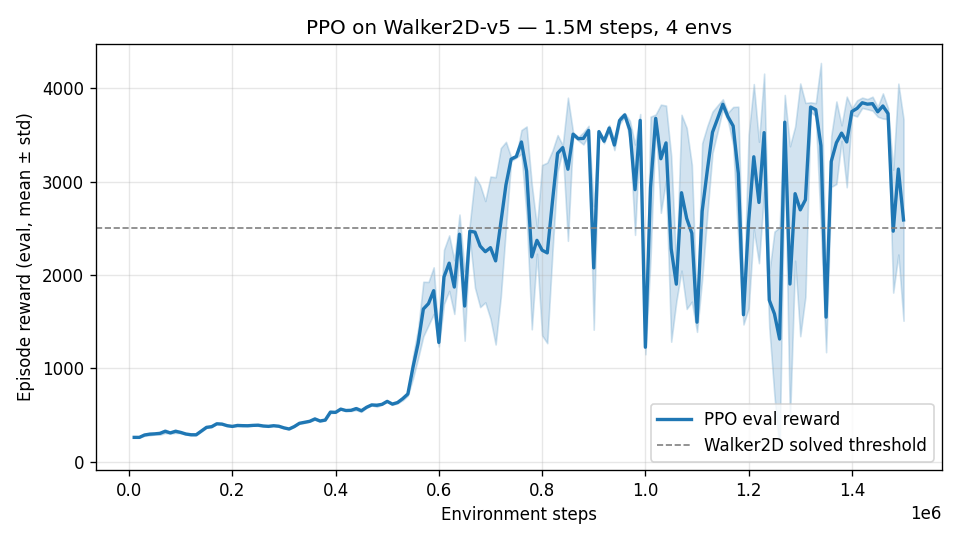
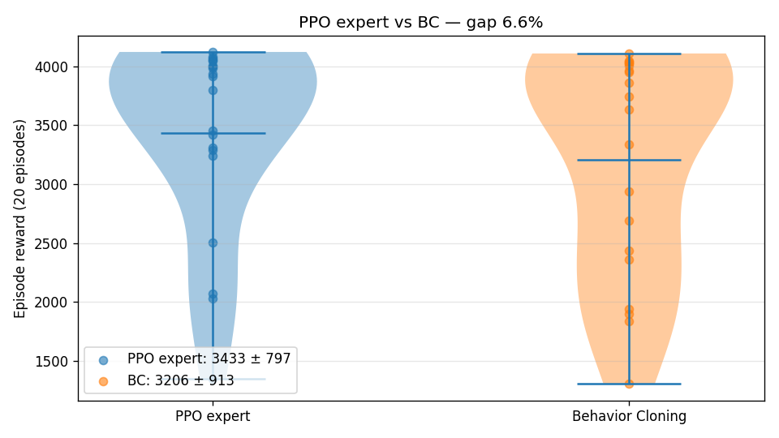

# Group Project — PPO + Behavior Cloning on Walker2D-v5

## 1. Objetivo

Entrenar un agente PPO baseline sobre `Walker2D-v5` (MuJoCo) y compararlo
contra una política aprendida por **Behavior Cloning** (BC) a partir de
trayectorias del experto. La motivación: cuantificar cuánto del rendimiento
del experto recupera una red supervisada simple sin interactuar con el entorno
durante el aprendizaje.

## 2. Setup

| Componente | Valor |
|---|---|
| Entorno | `Walker2D-v5` (MuJoCo) |
| Algoritmo baseline | PPO (Stable-Baselines3 2.8) |
| Política | `MlpPolicy` por defecto, `tanh` activations |
| Vec normalize | obs y reward (estadísticas online) |
| Total env steps | 1,500,000 |
| Envs paralelos | 4 |
| Seed | 42 |
| Hardware | Apple Silicon (CPU-only) |
| Tiempo de entrenamiento | 5 min 32 s (≈ 4,500 FPS) |

Hiperparámetros PPO usados (defaults SB3 salvo `n_steps`):

| Param | Valor |
|---|---|
| `n_steps` (rollout) | 2048 / env |
| `batch_size` | 64 |
| `n_epochs` | 10 |
| `learning_rate` | 3e-4 |
| `gamma` | 0.99 |
| `gae_lambda` | 0.95 |
| `clip_range` | 0.2 |
| `ent_coef` | 0.0 |
| `vf_coef` | 0.5 |
| `max_grad_norm` | 0.5 |

`EvalCallback` evaluó el modelo cada 10k steps con 5 episodios deterministas.

## 3. Resultados — PPO baseline



| Métrica | Valor |
|---|---|
| Reward al inicio | ~250 (política aleatoria) |
| Reward post-warmup (~500k steps) | ~400 (todavía explorando) |
| Reward inicio convergencia (~700k steps) | >2,500 (umbral resuelto) |
| Reward final eval (20 ep, seed 123) | **3,432.61 ± 797.19** |
| Episode length final | 858 ± 253 (de 1000 max) |
| `explained_variance` final | 0.95 |

**Lectura**: el agente pasa por una transición abrupta entre 500k–700k steps —
plateau largo seguido de salto, típico de control continuo donde la
política tiene que descubrir un *gait* periódico antes de poder
optimizarlo. La varianza en la curva post-convergencia (caídas a ~1,500
desde ~3,800) refleja que la política sigue moviéndose por el espacio de
soluciones; un schedule de LR decreciente la estabilizaría.

## 4. Resultados — Behavior Cloning

| Componente | Valor |
|---|---|
| Trayectorias del experto | 50 episodios deterministas (~43k pares (s, a)) |
| Arquitectura BC | MLP `tanh` `[256, 256]`, head `tanh` ∈ [-1, 1] |
| Optimizer | Adam 1e-3 |
| Loss | MSE sobre la acción media del experto |
| Epochs | 30 (batch 256, val split 0.1) |
| `val_loss` final | 0.0013 |

### Comparación expert vs BC (20 episodios deterministas, seed 123)



| Política | Reward (mean ± std) | Episode length |
|---|---|---|
| PPO experto | **3,432.61 ± 797.19** | 858 |
| BC (offline) | **3,206.34 ± 912.62** | 814 |
| **Gap absoluto** | **226.27** | — |
| **Gap relativo** | **6.6%** | — |

## 5. Discusión

### Por qué BC funciona tan bien aquí (93% del experto sin interacción)

Walker2D es un dominio amable para BC por tres razones:

1. **Reward denso**: cada paso da reward por velocidad lateral y costo por
   effort. La política no necesita planificar largo plazo, solo "estar de pie
   y avanzar". El supervisado no necesita descubrir crédito retardado.
2. **Dinámica suave**: locomoción es periódica, la marcha forma un atractor
   de baja dimensión. Una MLP de 256×256 aprende ese ciclo como una función
   suave casi sin distribution shift dentro del soporte de los datos.
3. **Cobertura razonable**: 50 trayectorias × ~860 steps ≈ 43k pares (s, a)
   en un espacio de observación de 17 dimensiones. Densidad suficiente para
   que la BC esté confiada en la mayoría de los estados que visita.

### Cuándo BC falla (no aquí, para contexto)

- **Sparse reward**: un solo error → episodio fallido sin gradient útil.
  Ejemplo: navegación con goal terminal.
- **Distribution shift severo**: el agente sale del soporte del experto y
  acumula error compuesto.
- **Multi-modalidad**: si el experto explora varias soluciones diferentes,
  MSE colapsa a la media (que puede ser inviable).

## 6. Extensiones propuestas (futuro trabajo)

1. **DAgger**: re-recolectar datos en estados que la política BC visita,
   etiquetar con el experto, re-entrenar. Cierra el 6.6% gap iterativamente.
   Es la extensión natural mencionada en el README del proyecto.
2. **PPO desde BC weights**: inicializar PPO con la red BC ya entrenada y
   continuar con interacción. Hipótesis: converge antes y con curva más
   estable porque arranca cerca del manifold de soluciones.
3. **Mismo experimento en `Ant-v5`**: 27-d observation (vs 17-d), reward más
   *gnarly* por el balance de patas. La BC debería sufrir más, abriendo el gap
   y haciendo más visible el valor de la interacción.
4. **Ablation de número de trayectorias**: BC con 5, 10, 25, 50, 100 trajs.
   Curva esperada: log-mejora con saturación temprana en este dominio.

## 7. Reproducibilidad

```bash
# 1) Train PPO baseline
python -m group_project.train_ppo --env Walker2d --steps 1500000 \
       --n-envs 4 --seed 42

# 2) Train BC on PPO trajectories
python -m group_project.imitation \
       --expert group_project/runs/ppo_walker2d/final_model.zip \
       --vecnorm group_project/runs/ppo_walker2d/vecnorm.pkl \
       --env Walker2d --episodes 50 --epochs 30 --seed 42

# 3) Evaluate side by side
python -m group_project.eval_policies \
       --expert group_project/runs/ppo_walker2d/final_model.zip \
       --vecnorm group_project/runs/ppo_walker2d/vecnorm.pkl \
       --bc group_project/runs/bc_walker2d/bc_model.keras \
       --env Walker2d --episodes 20 --seed 123

# 4) Regenerate report plots
python -m group_project.plot_results
```

## 8. Notas de implementación

- `eval_policies.py` se añadió para hacer la comparación 1:1 — no estaba en
  el scaffolding original (la sección "Opcional" del docstring de
  `imitation.py`).
- VecNormalize cargado en modo no-training (`env.training = False`,
  `env.norm_reward = False`) para que las estadísticas de obs sean fijas
  durante eval — crítico para que las dos políticas reciban inputs iguales.
- BC usa la acción **media** (`deterministic=True` en `model.predict`), no
  muestreada del Gaussian del experto. Esto es lo que casi todos los papers
  reportan.
