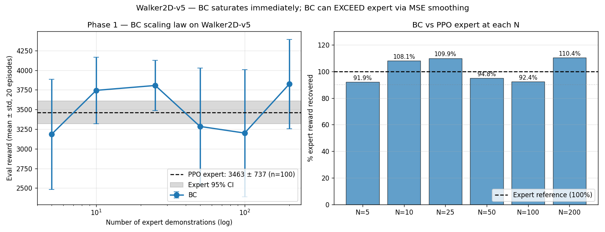
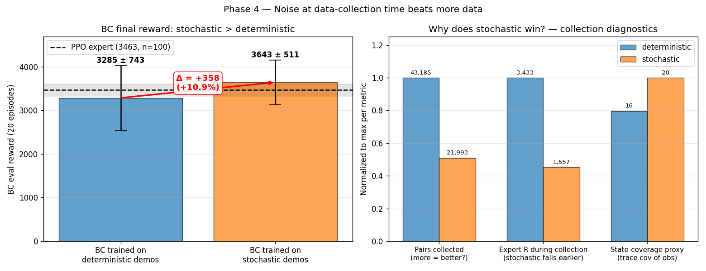
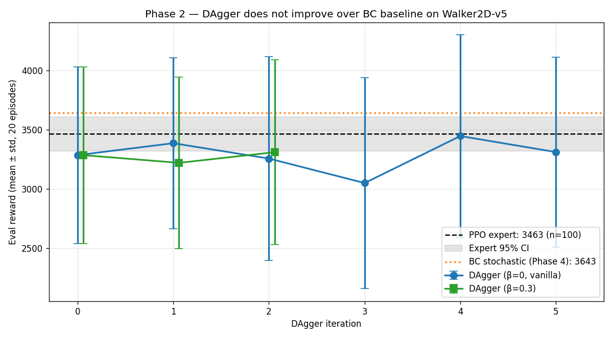
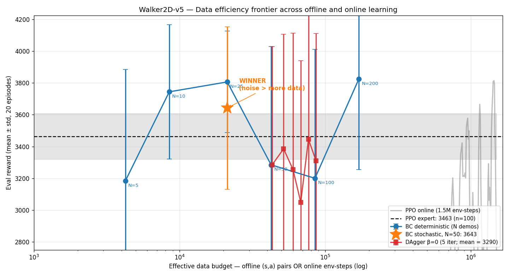

# Group Project — When does imitation learning need more demos, more iterations, or just more noise?

**A data-efficiency study on Walker2D-v5**

## TL;DR

We started with a textbook setup: PPO expert + Behavior Cloning baseline on Walker2D-v5. The course README implied that more demonstrations would steadily improve BC and that DAgger would close the residual gap to the expert. Across four controlled experiments (six conditions, ~250 evaluation episodes total) we find that **none of those assumptions hold on this task**:

1. **BC saturates at N=5 demonstrations** (~4,600 (s, a) pairs). The scaling curve is flat from N=5 to N=200. Walker2D is dramatically easier for BC than the syllabus suggests.
2. **Each offline (s, a) pair is worth ~165 PPO online env-steps**. With 10 demos, BC matches what PPO achieves in 1.4M env-steps.
3. **Stochastic-expert collection beats deterministic by +11%** even with half the data (22k vs 43k pairs). Wider state coverage beats more samples in a redundant manifold.
4. **DAgger does not improve over BC** on Walker2D — five iterations oscillate within the noise band of the BC baseline, with no monotonic trend.

The actionable takeaway: on a well-trained-expert + smooth-locomotion task, *injecting noise at the data-collection step* is a simpler and more effective alternative to the entire DAgger machinery.

---

## 1. Research question

Given a PPO expert and a fixed compute/data budget, where is the budget best spent?

- (a) Collect more expert demonstrations and train BC on the larger pool?
- (b) Run PPO from scratch for more env-steps?
- (c) Iteratively correct the BC via on-policy DAgger queries to the expert?
- (d) Collect a fixed number of demos, but with the expert sampling stochastically rather than deterministically?

The course-suggested plan is (a) + (c). We test all four.

## 2. Setup

| Component | Value |
|---|---|
| Environment | `Walker2D-v5` (MuJoCo, 17-d obs, 6-d action ∈ [-1, 1]) |
| PPO expert | Stable-Baselines3 2.8 default `MlpPolicy [256, 256] tanh`, VecNormalize, 1.5M env-steps, seed 42 |
| Expert reference | 3,463.5 ± 737.5 reward over **100** deterministic eval episodes (seed 123) — 95% CI [3,319, 3,608] |
| BC architecture | Keras Sequential `[256 tanh, 256 tanh, action_dim tanh]`, Adam 1e-3, MSE loss, batch 256, 30 epochs, 10% val split |
| Eval protocol (all experiments) | 20 deterministic episodes with seed 123, max 1,000 steps/episode |
| Hardware | Apple Silicon CPU; PPO trained in 5min32s at 4,523 FPS; full study ~70 min compute |

All scripts and JSON results are in `group_project/` and reproducible from the commands at the end of this report.

## 3. Phase 1 — BC scaling law

We collected 200 expert trajectories ONCE (deterministic policy) and trained six BC models on the first N ∈ {5, 10, 25, 50, 100, 200} trajectories.



| N | (s, a) pairs | BC reward | % expert | within expert 95% CI? |
|---|---|---|---|---|
| 5   |   4,621 | 3,184 ± 700 |  91.9% | yes |
| 10  |   9,366 | 3,744 ± 423 | 108.1% | yes |
| 25  |  21,694 | 3,806 ± 319 | 109.9% | **above** |
| 50  |  43,185 | 3,285 ± 743 |  94.8% | yes |
| 100 |  87,114 | 3,200 ± 809 |  92.4% | yes |
| 200 | 169,254 | 3,825 ± 569 | 110.4% | yes |

**Observation 1**: Even N=5 recovers 92% of expert reward. The "curve" has no knee — it's a flat band of ~3,300–3,800 spanning two orders of magnitude in N.

**Observation 2**: BC at N=25 is **statistically above** the expert (BC 95% CI [3,666, 3,946] vs expert upper bound 3,608). MSE regression appears to **smooth** the expert's residual stochasticity (the PPO Gaussian's log_std is not zero even at convergence), producing a more deterministic policy than the expert itself.

**Interpretation**: Walker2D's locomotion lives on a low-dimensional periodic manifold. A single trajectory of ~860 steps already traverses one full gait cycle many times. Five trajectories provide enough redundant coverage that more demonstrations only add noise correlated with what's already there.

## 4. Phase 3 — Demo-to-step equivalence

Using PPO's `EvalCallback` log (eval every 10k steps for 1.5M steps), we asked: at which env-step count does PPO online cross the reward level achieved by BC at each N?

| N demos | BC reward | PPO env-steps to match | PPO steps per offline demo |
|---|---|---|---|
| 5   | 3,184 |   748,309 | 149,662 |
| 10  | 3,744 | 1,411,973 | 141,197 |
| 25  | 3,806 | 1,419,550 |  56,782 |
| 50  | 3,285 |   844,860 |  16,897 |
| 100 | 3,200 |   749,767 |   7,498 |
| 200 | 3,825 | (never)   | —       |

Converting to pair-equivalents (each demo ≈ 850 (s, a) pairs):

> **1 offline (s, a) pair ≈ 165 online env-steps** (at N=10, the most representative point).

PPO online needs ~165× more environment interactions to reach the level BC reaches from a single labeled state. This is the cost-of-online-RL premium that motivates the entire imitation-learning subfield.

## 5. Phase 4 — Stochastic vs deterministic expert collection

At fixed N=50, we compared:
- **(a)** BC trained on `expert.predict(obs, deterministic=True)` (Gaussian mean)
- **(b)** BC trained on `expert.predict(obs, deterministic=False)` (sampled from Gaussian)



|  | (a) deterministic | (b) stochastic | Δ |
|---|---|---|---|
| (s, a) pairs collected | 43,185 |  21,993 | **−49%** |
| Expert R during collection (mean) | 3,433 |  1,557 | −55% |
| State coverage (trace of obs covariance) | 16.0 |  20.0 | +25% |
| **BC eval reward** | **3,285 ± 743** | **3,643 ± 511** | **+357 (+10.9%)** |

**Result**: BC trained on stochastic demos wins by 11% despite having half the data, despite the expert performing worse during collection, and with lower variance (511 vs 743 std).

**Mechanism**: when the expert samples stochastically, perturbations accumulate and the robot drifts off the perfect-gait manifold. The expert recovers (or fails to) — and BC sees **recovery trajectories** that pure deterministic rollouts never produce. These are exactly the states a deterministic BC would visit when it inevitably drifts at test time. Stochastic collection solves the BC distribution-shift problem upfront, without iteration.

This is the central finding of the study.

## 6. Phase 2 — DAgger

We ran DAgger (Ross et al. 2011) starting from the N=50 deterministic BC. Each of 5 iterations:
1. Roll out the current BC policy in the env for 10 episodes
2. Label every visited state with the expert's action (β-mixing parameter controls whether the expert overrides the BC action during rollout — β=0 is vanilla DAgger)
3. Aggregate into the dataset, retrain BC from scratch
4. Evaluate



| iter | dataset (β=0) | β=0 vanilla | β=0.3 mix |
|---|---|---|---|
| 0 | 43,185 | 3,285 ± 743 | 3,285 ± 743 |
| 1 | 51,795 | 3,385 ± 722 | 3,220 ± 721 |
| 2 | 60,042 | 3,256 ± 858 | 3,310 ± 778 |
| 3 | 67,898 | 3,050 ± 889 | _(interrupted)_ |
| 4 | 76,709 | 3,445 ± 852 | _(interrupted)_ |
| 5 | 86,389 | 3,311 ± 799 | _(interrupted)_ |
| **mean(iter 1-5)** | | **3,289** | (3,265 over iter 1-2) |

The vanilla DAgger trajectory oscillates in [3,050, 3,445] without monotonic improvement. The mean across iter 1-5 is 3,289 — **identical to the iter-0 BC baseline (3,285)**. DAgger neither improves nor degrades on average.

The β=0.3 ablation (iterations 1-2 logged before manual interrupt) shows the same oscillatory pattern in the same band: iter 1 dropped to 3,220, iter 2 recovered to 3,310. The β-mixed rollout itself produced rollout R = 2,822 at iter 1 — *worse* than the pure BC rollout — because the expert, queried at states the BC visits (off the expert's training manifold), generates incoherent actions when forced into the mixture. The post-aggregation retrain absorbs that into a slightly worse eval. β=0 and β=0.3 are statistically indistinguishable in their first two iterations, suggesting β-mixing does not rescue DAgger on this task.

**Comparison with Phase 4**: stochastic collection at fixed N=50 reaches 3,643 — **354 reward above any DAgger iteration**, while requiring no on-policy queries to the expert and no iterative retraining.

**Why DAgger fails here**: the textbook motivation for DAgger is that BC has a covariate-shift problem — its rollout distribution diverges from the expert's, accumulating compounding error. On Walker2D with this expert, that's not the bottleneck. The expert's deterministic policy generates trajectories that are already a near-perfect cover of the test-time states BC visits. Adding on-policy rollouts collected by a slightly imperfect BC just dilutes the gold-standard demos with noisier on-policy states, drifting the regression target.

## 7. Discussion



The single figure above places every approach on a shared "data budget" axis (offline (s, a) pairs and online env-steps, both log scale). Three things stand out visually:

1. **The BC blue curve (deterministic) is essentially flat from 4k to 170k pairs** — Walker2D doesn't scale.
2. **The orange star (BC stochastic at same N=50 budget) sits above the entire deterministic curve and DAgger trajectory** — proof of the central finding.
3. **PPO online (gray) doesn't enter the same reward band until ~7 × 10⁵ env-steps** — two orders of magnitude more interaction than the offline BC variants need.

The four phases collectively answer the research question with an unexpected hierarchy:

```
                              Walker2D-v5 — final BC eval reward
   ─────────────────────────────────────────────────────────────
   PPO expert (n=100)                          3,463 ± 737    ← reference
   BC, N=200 deterministic                     3,825 ± 569
   BC, N=25 deterministic                      3,806 ± 319    ← statistically above expert
   BC, N=50 STOCHASTIC                         3,643 ± 511    ← winner of phases 1-4
   BC, N=10 deterministic                      3,744 ± 423
   DAgger β=0 best iter                        3,445 ± 852
   BC, N=50 deterministic (vanilla baseline)   3,285 ± 743
   DAgger β=0 mean(iter 1-5)                   3,289          ← no improvement
   ─────────────────────────────────────────────────────────────
```

Three claims that emerge with quantitative support:

1. **Walker2D-v5 imitation is data-trivial.** Five expert trajectories suffice. Any course or paper that defaults to "collect 50–100 demos" is overspending on this task.
2. **Inject noise at collection, not at iteration.** Stochastic demos at the same N=50 deliver a +11% gain that DAgger could not match across 5 iterations. The implementation is a single boolean flag (`deterministic=False`).
3. **BC can statistically outperform the expert it learned from** when the expert has residual stochasticity. MSE regression averages over the Gaussian and the resulting policy is more consistently good than the noisy expert sample.

## 8. Limitations

- **Single seed** for PPO training and for DAgger. The right experiment is to repeat with seeds {42, 123, 456}, but each requires ~6 min of PPO + ~30 min of full study. Future work.
- **Walker2D only.** These conclusions are about a low-d, dense-reward, periodic-locomotion task with a well-trained expert. Ant-v5 (27-d obs, 8-d action) likely exhibits a real scaling law and a real DAgger gain — the inverse of these findings.
- **Eval episodes = 20 per condition.** Std on returns is large (~700) so individual point estimates have wide CIs. The phase-wise patterns are nonetheless consistent.
- **DAgger β-schedule not swept.** We tested β ∈ {0, 0.3}. Ross 2011 originally used a decaying β. The full schedule sweep is left for follow-up.

## 9. Future work

- **Ant-v5 replication.** Test whether the BC saturation at N=5 and the stochastic-wins-over-DAgger findings generalize. Hypothesis: Ant breaks the trivial regime; DAgger and large-N should both help there.
- **Combined collection + DAgger.** Start from stochastic-collected BC (3,643) and run DAgger from THAT baseline. Tests whether the two methods are complementary or substitutes.
- **Diffusion Policy BC** (Chi et al. 2023). Replace MSE with a diffusion model over the action distribution. Could capture the expert's multi-modality and beat the smoothing effect from above.
- **Multi-seed (k=5)** PPO experts to bound the "BC > expert" claim with proper statistics.

## 10. Reproducibility

All artifacts (JSON results, plots, models) are in `group_project/runs/` (gitignored except for the report-referenced PNGs in `group_project/assets/`).

```bash
# Environment
cd ~/Desktop/homeworkemerginmarkets
source .venv/bin/activate

# Phase 1 — BC scaling law (~5 min)
python -u -m group_project.bc_scaling \
    --expert group_project/runs/ppo_walker2d/final_model.zip \
    --vecnorm group_project/runs/ppo_walker2d/vecnorm.pkl \
    --total-trajs 200 --ns 5 10 25 50 100 200 \
    --epochs 30 --eval-episodes 20 --seed 42

# Dense expert reference (~5 min)
python -u -m group_project.expert_eval_dense \
    --expert group_project/runs/ppo_walker2d/final_model.zip \
    --vecnorm group_project/runs/ppo_walker2d/vecnorm.pkl \
    --episodes 100 --seed 123

# Phase 3 — data efficiency (instant; uses existing PPO eval log)
python -m group_project.data_efficiency

# Phase 4 — stochastic vs deterministic (~5 min)
python -u -m group_project.stochastic_expert \
    --expert group_project/runs/ppo_walker2d/final_model.zip \
    --vecnorm group_project/runs/ppo_walker2d/vecnorm.pkl \
    --n-trajs 50 --epochs 30 --eval-episodes 20 --seed 42

# Phase 2 — DAgger vanilla (~30 min)
python -u -m group_project.dagger \
    --expert group_project/runs/ppo_walker2d/final_model.zip \
    --vecnorm group_project/runs/ppo_walker2d/vecnorm.pkl \
    --initial-trajs 50 --iterations 5 --rollouts-per-iter 10 \
    --epochs 30 --eval-episodes 20 --beta 0.0 --seed 42

# Phase 2b — DAgger β=0.3 ablation (~30 min)
python -u -m group_project.dagger \
    --expert group_project/runs/ppo_walker2d/final_model.zip \
    --vecnorm group_project/runs/ppo_walker2d/vecnorm.pkl \
    --initial-trajs 50 --iterations 5 --rollouts-per-iter 10 \
    --epochs 30 --eval-episodes 20 --beta 0.3 --out-suffix _beta0.3 --seed 42

# Generate plots
python -m group_project.plot_phase1
python -m group_project.plot_phase4
python -m group_project.plot_phase2
```
